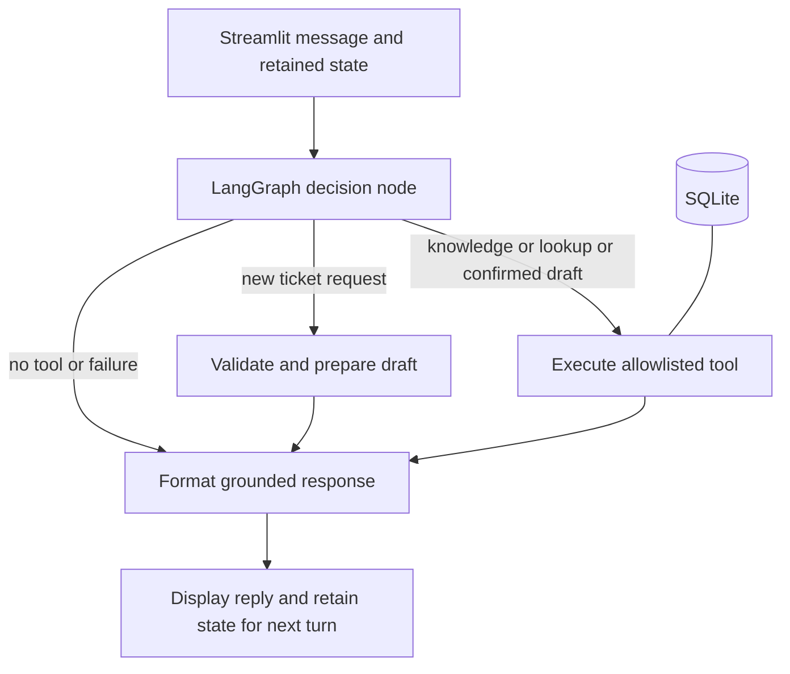

# Northstar AI Operations Assistant

Project 3 — AI Operations Assistant Using Agentic AI

Submitted by **Rajat Singodia**.

Repository: [rasingod/ai-operations-assistant](https://github.com/rasingod/ai-operations-assistant)

A local IT support assistant built with Python, LangGraph, Streamlit and SQLite. It searches IT guidance, retrieves an employee's support tickets and creates validated tickets after explicit confirmation.

## Problem statement

Employees repeatedly need troubleshooting instructions and ticket status updates. A chat assistant can route these requests to small, auditable tools while retaining the context needed to collect missing issue details.

## Solution overview

The LLM selects a function and supplies schema-validated arguments. LangGraph routes the action, runs the local tool and formats a grounded response. Ticket writes require a visible draft followed by `confirm`. Offline demo mode uses the same graph and tools with a deterministic planner, so evaluators can run the project without a paid API account. **Demo mode does not demonstrate GenAI. Use LLM mode for that assessment.**

This is a tested local submission with production-oriented safeguards. It is not an internet-facing enterprise deployment: employee selection is a fictional demo identity, not authentication. See [deployment boundaries](docs/OPERATIONS.md).

## Quick start

Requires Python 3.12 and internet access for the initial dependency install. Run commands inside this directory.

### Windows PowerShell

```powershell
python -m venv .venv
.\.venv\Scripts\python.exe -m pip install -r requirements.txt
if (-not (Test-Path .env)) { Copy-Item .env.example .env }
.\.venv\Scripts\python.exe -m streamlit run app.py
```

### macOS / Linux

```bash
python3.12 -m venv .venv
.venv/bin/python -m pip install -r requirements.txt
test -f .env || cp .env.example .env
.venv/bin/python -m streamlit run app.py
```

Open `http://127.0.0.1:8501`. Choose employee **EMP1024**. The app seeds its database automatically. No manual database setup is required.

### LLM mode

Edit the local `.env`:

```dotenv
ASSISTANT_MODE=llm
OPENROUTER_API_KEY=your-own-key
OPENROUTER_MODEL=openai/gpt-4.1-mini
```

Restart Streamlit. The SDK connects to `https://openrouter.ai/api/v1`. An OpenRouter key is required, not an OpenAI account key. Your key stays in the ignored local `.env` and is never part of the submission archive.

For free inference, set `OPENROUTER_MODEL=openrouter/free`. Free models can vary between calls and may hit provider capacity or daily limits. The planner rejects missing, multiple or malformed tool calls. It never silently replaces the LLM with offline rules.

Use a model available to your account that supports Chat Completions function calling with strict schemas. Model access and billing are account-dependent. Do not commit `.env`. LLM mode sends the current message and up to six recent history entries to OpenRouter and its selected model provider. Use only fictional data for evaluation. Tool results are rendered locally and accurately, without a second LLM rewriting ticket facts.

## Configuration

| Variable | Default | Purpose |
|---|---|---|
| `ASSISTANT_MODE` | `demo` | `demo` or `llm` |
| `OPENROUTER_API_KEY` | empty | Required only in LLM mode |
| `OPENROUTER_MODEL` | `openai/gpt-4.1-mini` | Configurable function-calling model |
| `DATABASE_PATH` | `runtime/support.db` | Relative to project root or an absolute path |
| `LOG_LEVEL` | `INFO` | Python logging level |

## Architecture



The graph uses `StateGraph`, four explicit nodes, conditional routing and `START`/`END` edges. The shared tool node dispatches three allowlisted functions. Each turn has a bounded graph invocation. The response node formats actual results. [Standalone diagram](docs/architecture.mmd).

## Technology stack

- Python 3.12 with type hints and modular modules.
- LangGraph for stateful workflow orchestration.
- OpenAI-compatible Python SDK connected to OpenRouter for LLM function calling with strict JSON schemas.
- Pydantic for tool argument validation and unknown-field rejection.
- SQLite for employee records, articles, tickets and a write audit.
- Streamlit for chat, history, employee selection, reset and tool traces.
- pytest and Streamlit AppTest for workflow and UI verification.

## Project structure

```text
app.py                         Streamlit interface
ops_assistant/
  agent.py                     Graph, state and guarded execution
  router.py                    LLM functions, prompt and demo planner
  store.py                     SQLite repository and duplicate protection
  config.py                    Environment settings
data/seed.json                 3 employees, 6 articles, 3 tickets
tests/                        Workflow, storage, SDK contract and UI tests
scripts/demo.py                Reproducible offline demonstration
docs/                         Report, architecture, live demo, operations, validation
.github/workflows/tests.yml    CI checks
.streamlit/config.toml         Localhost defaults and theme
requirements.txt              Exact direct runtime dependencies
requirements-dev.txt          Runtime dependencies plus pytest
requirements-lock.txt         Tested environment dependency snapshot
.env.example                  Safe configuration example
```

## Sample inputs and outputs

| Input as EMP1024 | Expected behavior |
|---|---|
| `How do I reset my VPN password?` | Retrieved guidance labelled `[KB001]`; other related matches may follow |
| `What is the status of my laptop issue?` | `IT-1001`, laptop battery issue, `In progress` |
| `What is the status of IT-1003?` | No matching ticket for this employee |
| `Please raise a ticket` | Ask for an issue description |
| `My printer prints blank pages` after the previous input | Retain creation intent and show a draft |
| `confirm` | Create `IT-<generated ID>`, status `Open` |
| Repeat the same creation and confirmation | Reuse the identical active ticket |
| `cancel` while a draft is pending | Discard the draft without writing |
| `hello` | Explain supported capabilities without a tool |

New IDs and UTC timestamps vary. Seed ticket IDs remain stable. Exact wording and routing may vary in LLM mode.

## State and memory

`Assistant.state` retains the employee ID, recent conversation, pending creation intent, draft, latest result and trace. Streamlit keeps one assistant per browser session. Profile changes create a fresh assistant to prevent context leakage. Chat history is bounded to 20 turns. Browser-session loss or server restart loses chat state, while tickets persist in SQLite. This explicitly managed graph state does not use a durable LangGraph checkpointer.

## Safety and design decisions

1. **The model cannot choose employee identity.** The selected profile supplies tool scope outside model arguments. The demo selector itself is not secure authentication.
2. **Writes require confirmation.** A model-selected creation action only prepares a draft. A later exact `confirm` message authorizes that draft. Other messages cannot replace a pending draft. `cancel` discards it.
3. **Validation runs at multiple boundaries.** Unknown functions and malformed arguments fail closed. The store independently validates employee identity and ticket lengths.
4. **Deduplication is transactional.** A normalized description fingerprint and a unique partial index prevent identical active issues for the same employee, even under concurrent submissions. Case, whitespace and punctuation differences normalize away. Paraphrases are not semantic duplicates.
5. **Retrieved facts remain retrieved facts.** KB responses include article IDs. Ticket IDs/statuses come directly from SQLite. The application does not generate unsupported recommendations or rewrite retrieved facts with an LLM.
6. **Failures stay recoverable.** The API uses a 20-second timeout and one retry, a 1,200-token output cap, and provider parameter filtering. Authentication, credit, rate-limit and connection errors have actionable messages. Invalid planner output takes no action. Tool failures produce a safe message. Logs record event type without prompt bodies or secrets.
7. **Local-first scope.** SQLite keeps the project achievable on one machine. Bounded history and a single action per turn keep behavior explainable.

## Testing and demonstration

```powershell
.\.venv\Scripts\python.exe -m pip install -r requirements-dev.txt
.\.venv\Scripts\python.exe -m pytest -q
.\.venv\Scripts\python.exe scripts/demo.py
```

The demo uses a temporary database and leaves application data untouched. See [validation evidence](docs/VALIDATION.md), [live demonstration script](docs/DEMO_GUIDE.md), and [submission checklist](docs/SUBMISSION_CHECKLIST.md). A live demonstration is the selected option allowed by the brief. A transcript supports preparation but does not replace delivering that live demonstration.

## Limitations

- No SSO, role-based administration, production hosting, external ticketing integration or enterprise monitoring.
- Keyword search is lexical and English-focused. It is not an embedding/vector RAG system.
- Duplicate detection is exact after normalization, not semantic similarity.
- One tool action per turn. Multi-step ticket collection/confirmation spans turns. Compound requests should be split.
- The LLM can misunderstand intent. It cannot write without draft confirmation, and broader model quality still needs evaluation beyond the five successful acceptance checks.
- No persistent conversation recovery, ticket update/delete tools, attachment ingestion or SLA engine.
- Five live OpenRouter workflow checks passed on 13 September 2026 using `openrouter/free`. This small acceptance run does not establish broad model accuracy or availability.

## Troubleshooting

If startup fails, check `ASSISTANT_MODE`, the API key for LLM mode, and write permission on the database directory. For import errors, run pip using the same virtual-environment Python used to launch Streamlit. If port 8501 is occupied, append `--server.port 8502`. For a model error, confirm model access and billing, then retry. Do not silently switch to demo mode during a GenAI evaluation.

## References

Implementation reference: [LangGraph Graph API](https://docs.langchain.com/oss/python/langgraph/graph-api) and [OpenAI function calling](https://developers.openai.com/api/docs/guides/function-calling). The authoritative requirements are the supplied Project 3 brief, copied into `docs/PROJECT_BRIEF.txt`.

## OpenRouter acceptance check

After adding your key locally, run `python scripts/live_check.py`. This uses a temporary SQLite database and fictional inputs to check real knowledge retrieval, scoped lookup, missing details, draft preparation and confirmed creation. Paid model selections incur provider charges. The script exits nonzero on any failed check and never prints credentials or raw provider errors.

OpenRouter references: [SDK connection](https://openrouter.ai/docs/quickstart), [tool calling](https://openrouter.ai/docs/guides/features/tool-calling), [free router](https://openrouter.ai/docs/guides/routing/routers/free-router).

The planner permits one corrective retry for malformed tool output, then fails without taking an action. HTTP errors return safe, specific messages for authentication, credit limits, rate limits and unavailable providers. The SDK also bounds transport retries. Free-router availability and model behavior can vary between calls.
